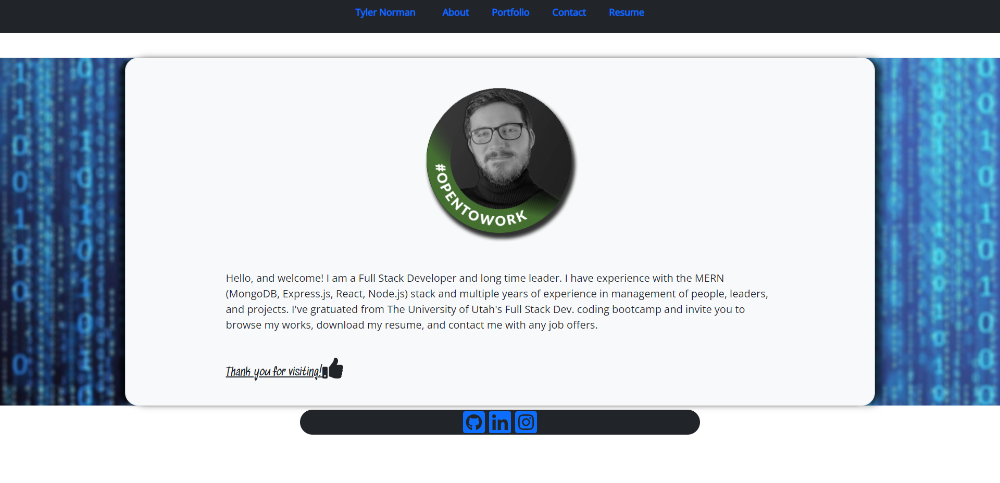

# <h1 align="center">Portfolio: Tyler Norman</h1>

    
    

    

<a href="https://t-norm.github.io/portfolio/" target="_lank">See my portfolio here!</a>

# Description:
My MERN Stack/Web Dev. portfolio

# Table of Contents:
- [Description](#description)
- [Installation](#installation)
- [Usage](#usage)
- [Contribution](#contribution)
- [Tests](#tests)
- [License](#license)
- [Questions](#questions)

# Installation:
N/A
Site live at: https://t-norm.github.io/portfolio/

# Usage:
Used to showcase my web dev. abilities

# Contribution:
N/A

# Tests:
N/A

# License:

For more information, please go to <a href="https://choosealicense.com/licenses/" target="_blank">choosealicense.com/licenses/</a>

# Questions:

Find me on GitHub: [t-norm](https://github.com/t-norm)

Email me with any questions: tnorman600@gmail.com